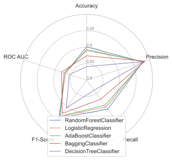

# Citibike Coding Challenge

## Problemstellung

1. Lade diese Daten von Citibike für das Jahr 2018 herunter. Mach dich mit dem Inhalt
   des Datensatzes vertraut und bereite ihn für weitere Analysen auf.

2. Visualisiere die Daten; sei kreativ und überlege dir geeignete Darstellungsformen
   für deine Entdeckungen. Nutze die Visualisierungen auch in deiner
   Ergebnispräsentation um deine Argumente zu unterstützen.

3. Überlege dir geeignete Features (Merkmale) als Input für Ihr
   customer-subscriber-Modell. Konstruiere gegebenenfalls neue Features um dein Modell
   zu verbessern.

4. Verteste verschiedene Modelle bzw. Methoden zur Klassifikation der Kundentypen
   subscribers und customers. Evaluiere die Performance der unterschiedlichen Modelle
   und begründen eine Modellauswahl.

5. Skizziere mögliche Einsatzgebiete oder UseCases mit denen Citibike das
   Geschäftsmodell weiterentwickeln kann.

## Lösungsskizze

Für jeden der fünf oberen Punkte will ich hier in etwa Prosa beschreiben was die
Ideen waren und wie ich diese umgesetzt habe.

### Laden und Vorbereiten

Meine Grundidee ist es den Download der Daten so anzugehen, dass etwaige
Erweiterungen relativ einfach umzusetzen sind, wie bspw. weitere Jahre zu laden.
Deswegen habe ich mich dafür entschieden einmal den Download Index als Datei
herunterzuladen [index.html](data/download-page-index.html) und von diesem mit
Scrapy die Links zu extrahieren. Diese Liste der Links wird dann über meherere
Stationen abgearbeitet, indem erst die zip Dateien geladen werden und dann in parquet
Dateien transformiert werden. Diese werden dann nach S3 geladen, so dass sie nach
Snowflake importiert werden können. Dazu habe ich eine Klasse gebastelt, die die
daraus resultierende Pipeline relativ kompakt und sprechend in die [main.py](main.py)
bringt:

~~~
from download.collector import Collector
Collector().download_files().prep_base_files().upload_files()
~~~

Zusätzliche Beschreibungen zu den einzelnen Methoden würde ich dann später in der
README aus dem [download](download/README.md) Modul ergänzen.

In Snowflake habe ich vorher mit Terraform eine Tabelle angelegt, welche die Daten
aus den Parquet Dateien in eine VARIANT Spalte für semi-strukturierte Daten lädt. Damit
stelle ich sicher, dass immer alles reibungslos geladen wird. Die Beschreibungen
der Tabellen habe ich damit auch unter Versionskontrolle und unter
[citibike.tf](terraform/citibike.tf) abgelegt.

Da die Daten in der VARIANT Spalte aber eine schlechte Schnittstelle für Business
Intelligence Tools sind, habe ich sie danach mit dbt in "rechteckige" Tabellen
umgewandelt: [tripdata.sql](models/models/citibike/tripdata.sql). Die Idee ist, dass
so auch Veränderungen an den Snowflake Tabellen unter Versionskontrolle stehen und
tendenziell immer konsistente Stände zwischen den Snowflake Schnittstelle und den
späteren ML Modellen entstehen. Die Schnittstelle für die Verarbeitung in Python
wird dann später die Tabelle
[tripfeatures_labeled.sql](models/models/citibike/tripfeatures_labeled.sql) sein.

Bei der Recherche zur Logistischen Regression bin ich über das Konzept des Over- und 
Undersampling gestoßen. Wenn ich es richtig verstehe ist die Idee bei binären 
Klassifikationen mit großer Schiefe in der Verteilung

## Visualisierung

Zur Visualisierung habe ich Apache Superset verwendet. Das Rational dahinter ist
ähnlich wie bei der obigen Entscheidung Parquet Files und die durch Terraform
angelegten Snowflake Tabellen mit Variant Datentyp zu verwenden: Ich habe es in eigenen
kleinen Projekten auch schon so gemacht und damit relativ einfach zur Hand. In meiner
lokalen Docker Installation spiele ich also einen Helm Chart ein und habe so meine
lokale Installation hochgefahren.

## Feature Engineering

Wie zuvor erwähnt sind die Features in der Tabelle 
[tripfeatures_labeled.sql](models/models/citibike/tripfeatures_labeled.sql)
angesiedelt. Zu jedem der dort existieren Features würde ich hier per Auflistung 
einmal die Idee aufschreiben wollen:

- IS_SUBSCRIBER
  - (unverändert übernommen) Unterscheidung zwischen Jahres-Abos (Subscriber) oder 
    Kunden die nur einen Tages/Stunden-Pass gebucht haben (Customer).
- GENDER
  - (unverändert übernommen) Das Geschlecht der fahrenden Person. Für nicht 
    registrierte Personen kann das Geschlecht auch unbekannt sein. Das wird später 
    in der Feature Selection noch einmal entscheidend werden.
- TRIPDURATION_IN_H
  - Die Dauer der Miete ist in Sekunden in den Rohdaten enthalten, ich habe diese in 
    Stunden umgerechnet um leichter die Geschwindigkeit (km/h) auszurechnen und auch 
    leichter lesbare Koeffizienten in der Regression zu erhalten.
- START_DOW
  - Über die Startzeit habe ich den Tag der Woche abgeleitet. Die Idee war hier, 
    dass ich mir vorstellen könnte, dass mehr Freizeitfahrten am Wochenende stattfinden.
- START_MONTH
  - Analog zum DOW könnte ich mir vorstellen, dass mehr Freizeitfahrten in den 
    Sommermonaten entstehen regelmäßigere Nutzer etwas witterungsunabhängiger sind.
- START_HOUR
  - Auch die Stunden habe ich in Kategorien umgewandelt. Einfach aus dem Argument 
    heraus, dass wir ja sehr viele Beobachtungen haben und ich auch wieder vermuten 
    würde, dass regelmäßige Nutzer typischerweise in den Morgenstunden fahren, 
    während Freizeitfahrten eher am Abend stattfinden.
- CUSTOMER_AGE
  - Gegeben war nur das Geburtsjahr. Aus Darstellungsgründen wandle ich das linear 
    in ein Altersproxy um.
- TRIP_DISTANCE_IN_KM
  - Aus dem Start und Ziel habe ich die Distanz (Luftlinie) des Trips berechnet.
- TRIP_SPEED_KMH
  - Aus den beiden oberen Distanz und Zeit Metriken lässt sich eine 
    Durchschnittsgewschwindigkeit ableiten, die sich später auch relativ gut für die 
    Vorhersagen eignen wird. Meine Vermutung ist ein wenig, dass der 
    Geschwindigkeitsunterschied aus der Erfahrung auf der Strecke, bzw. deren 
    Optimierung rührt. Vielleicht sind es auch Vielfahrer, die etwas fitter auf dem 
    Rad sind. In der logistischen Regression kommt das Feature aber hervorragend weg.
- FEELSLIKE
  - Oben habe ich ja schon ein wenig darauf angespielt, dass ich mir vorstellen 
    könnte, dass Subscriber tendenziell auch Pendler sind. Daher habe ich noch aus 
    einer anderen Quelle die Tagesdurchschnittswerte für New York heruntergeladen 
    und einfach pro Tag angespielt. Feelslike spiegelt die gefühlte Temperatur 
    wider. Auch diese Daten habe ich analog zu eben über eine in Terraform angelegte 
    Tabelle eingespielt ([wetterdaten.tf](terraform/wetterdaten.tf)) und dann per 
    dbt in eine rechteckige Tabelle umgewandelt 
    [wetterdaten.sql](models/models/citibike/wetterdaten.sql)
    und an die Trip-Features gejoined:
    [tripfeatures .sql](models/models/citibike/tripfeatures.sql)
- HUMIDITY
  - Hier hatte ich gehofft, dass die Luftfeuchtigkeit vielleicht auch ein Proxy 
    dafür ist wie unangenehm/schwitzig eine Radtour werden könnte.
- SNOWDEPTH
  - Ich tippe so viel Schnee ist nicht in New York, aber bei Tiefschnee fährt doch 
    keiner^^
- WINDSPEED
  - Wer will schon bei starkem Wind Rad fahren?

## Model Estimation

|                        |   Accuracy |   Precision |   Recall |   F1-Score |   ROC AUC |
|:-----------------------|-----------:|------------:|---------:|-----------:|----------:|
| RandomForestClassifier |      0.901 |       0.979 |    0.909 |      0.943 |     0.868 |
| LogisticRegression     |      0.893 |       0.98  |    0.9   |      0.938 |     0.868 |
| AdaBoostClassifier     |      0.89  |       0.982 |    0.894 |      0.936 |     0.872 |
| BaggingClassifier      |      0.874 |       0.986 |    0.872 |      0.925 |     0.88  |
| DecisionTreeClassifier |      0.841 |       0.983 |    0.838 |      0.905 |     0.855 |

